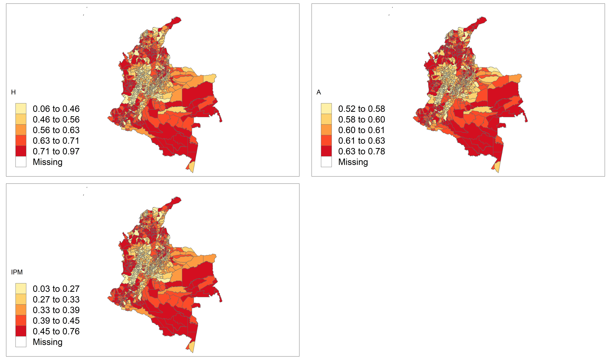

# Aplicación: Índice de Pobreza Multidimensional en Colombia. 

Nos centramos en la incidencia de la pobreza multidimensional descrito previamente. En este caso, requerimos $K = 8$ indicadores que se miden como privaciones: $y_{di}^{k} = 1$ si la persona tiene la privación y $y_{di}^{k} = 0$ si la persona no ha tenido la privación.

El índice requiere información para cada individuo $i = 1, \ldots, N_d$ en los dominios $d = 1, \ldots, D$, donde $N_d$ denota el tamaño de la población del dominio $d$.

La función indicadora $I(\cdot)$ es igual a 1 cuando se cumple la condición $q_{di} > z$. Para este estudio, utilizamos el valor de 0.4 para $z$, es decir, $I(\cdot)$ es igual a 1 cuando $q_{di} > 0.4$. $q_{di}$ es una cantidad ponderada que considera los $K = 8$ indicadores que conforman el índice. El valor de $q_{di}$ el dominio $d$ se calcula como:
  
$$
  q_{di} = 0.1\sum_{k=1}^{6}y_{di}^{k} +  0.2(y_{di}^{7} + y_{di}^{8})
$$
  
  Donde: 
  a. $y_{di}^{1}$ = Privación en material de construcción de la vivienda

  b. $y_{di}^{2}$ = Hacinamiento en el hogar. 

  c. $y_{di}^{3}$ = Privación de acceso al agua potable. 

  d. $y_{di}^{4}$ = Privación en saneamiento.

  e. $y_{di}^{5}$ = Acceso al servicio energía eléctrica. 

  f. $y_{di}^{6}$ = Acceso al servicio de internet.

  g. $y_{di}^{7}$ = Privación de la educación. 

  h. $y_{di}^{8}$ = Privación del empleo y la protección social.  

Note que, la primera parte de la suma considera los indicadores de las dimensiones de vivienda, agua y saneamiento, energía y conectividad. La segunda parte, los indicadores de las dimensiones de educación y empleo y protección social. 

Los datos de la encuesta y el censo han sido preparados previamente, la información sobre la cual realizaremos la predicción corresponde a Colombia en el 2019 


```r
encuesta_ipm <-
  readRDS("Modelo_bayes_HxA/COL/Data/encuesta_COL.rds")
statelevel_predictors_df <-
  readRDS("Modelo_bayes_HxA/COL/Data/statelevel_predictors_df_dam2.rds") %>% 
  rename(depto = dam, mpio = dam2)

byAgrega <- c("depto",
              "mpio",
              "area",
              "sexo",
              "etnia",
              "anoest",
              "edad",
              "condact3")
```

Agregando la información para los municipios de Colombia para los indicadores que conformarán el IPM


```r
names_ipm <- grep(pattern = "ipm", names(encuesta_ipm),value = TRUE)

encuesta_df <- map(setNames(names_ipm,names_ipm),
    function(y){
  encuesta_ipm$temp <- encuesta_ipm[[y]]
  encuesta_ipm %>% 
  group_by_at(all_of(byAgrega)) %>%
  summarise(n = n(),
            yno = sum(temp),
            ysi = n - yno, .groups = "drop") %>% 
    inner_join(statelevel_predictors_df,
                              by = c("depto","mpio"))
})
```

La base resultante quedan de la siguiente forma:

<table class="table table-striped lightable-classic" style="width: auto !important; margin-left: auto; margin-right: auto; font-family: Arial Narrow; width: auto !important; margin-left: auto; margin-right: auto;">
<caption>(\#tab:unnamed-chunk-3)Privaci'on en material de construcci'on de la vivienda</caption>
 <thead>
  <tr>
   <th style="text-align:left;"> depto </th>
   <th style="text-align:left;"> mpio </th>
   <th style="text-align:left;"> area </th>
   <th style="text-align:left;"> sexo </th>
   <th style="text-align:left;"> etnia </th>
   <th style="text-align:left;"> anoest </th>
   <th style="text-align:left;"> edad </th>
   <th style="text-align:right;"> condact3 </th>
   <th style="text-align:right;"> n </th>
   <th style="text-align:right;"> yno </th>
   <th style="text-align:right;"> ysi </th>
   <th style="text-align:right;"> area1 </th>
   <th style="text-align:right;"> sexo2 </th>
   <th style="text-align:right;"> edad2 </th>
   <th style="text-align:right;"> edad3 </th>
   <th style="text-align:right;"> edad4 </th>
   <th style="text-align:right;"> edad5 </th>
   <th style="text-align:right;"> etnia2 </th>
   <th style="text-align:right;"> anoest2 </th>
   <th style="text-align:right;"> anoest3 </th>
   <th style="text-align:right;"> anoest4 </th>
   <th style="text-align:right;"> etnia1 </th>
   <th style="text-align:right;"> tiene_acueducto </th>
   <th style="text-align:right;"> piso_tierra </th>
   <th style="text-align:right;"> alfabeta </th>
   <th style="text-align:right;"> hacinamiento </th>
   <th style="text-align:right;"> tasa_desocupacion </th>
   <th style="text-align:right;"> luces_nocturnas </th>
   <th style="text-align:right;"> cubrimiento_cultivo </th>
   <th style="text-align:right;"> cubrimiento_urbano </th>
   <th style="text-align:right;"> modificacion_humana </th>
   <th style="text-align:right;"> accesibilidad_hospitales </th>
   <th style="text-align:right;"> accesibilidad_hosp_caminado </th>
  </tr>
 </thead>
<tbody>
  <tr>
   <td style="text-align:left;"> 11 </td>
   <td style="text-align:left;"> 11001 </td>
   <td style="text-align:left;"> 1 </td>
   <td style="text-align:left;"> 1 </td>
   <td style="text-align:left;"> 3 </td>
   <td style="text-align:left;"> 3 </td>
   <td style="text-align:left;"> 2 </td>
   <td style="text-align:right;"> 1 </td>
   <td style="text-align:right;"> 1434 </td>
   <td style="text-align:right;"> 5 </td>
   <td style="text-align:right;"> 1429 </td>
   <td style="text-align:right;"> 0.9979 </td>
   <td style="text-align:right;"> 0.5219 </td>
   <td style="text-align:right;"> 0.2690 </td>
   <td style="text-align:right;"> 0.2316 </td>
   <td style="text-align:right;"> 0.2251 </td>
   <td style="text-align:right;"> 0.0886 </td>
   <td style="text-align:right;"> 0.0093 </td>
   <td style="text-align:right;"> 0.2098 </td>
   <td style="text-align:right;"> 0.3810 </td>
   <td style="text-align:right;"> 0.2938 </td>
   <td style="text-align:right;"> 0.0027 </td>
   <td style="text-align:right;"> 0.0219 </td>
   <td style="text-align:right;"> 0.0026 </td>
   <td style="text-align:right;"> 0.0143 </td>
   <td style="text-align:right;"> 0.0848 </td>
   <td style="text-align:right;"> 0.0176 </td>
   <td style="text-align:right;"> 22.0069 </td>
   <td style="text-align:right;"> 9.1869 </td>
   <td style="text-align:right;"> 19.7751 </td>
   <td style="text-align:right;"> 0.5697 </td>
   <td style="text-align:right;"> 61.3823 </td>
   <td style="text-align:right;"> 259.2423 </td>
  </tr>
  <tr>
   <td style="text-align:left;"> 47 </td>
   <td style="text-align:left;"> 47001 </td>
   <td style="text-align:left;"> 1 </td>
   <td style="text-align:left;"> 1 </td>
   <td style="text-align:left;"> 3 </td>
   <td style="text-align:left;"> 3 </td>
   <td style="text-align:left;"> 3 </td>
   <td style="text-align:right;"> 1 </td>
   <td style="text-align:right;"> 1432 </td>
   <td style="text-align:right;"> 17 </td>
   <td style="text-align:right;"> 1415 </td>
   <td style="text-align:right;"> 0.9150 </td>
   <td style="text-align:right;"> 0.5158 </td>
   <td style="text-align:right;"> 0.2705 </td>
   <td style="text-align:right;"> 0.2125 </td>
   <td style="text-align:right;"> 0.1913 </td>
   <td style="text-align:right;"> 0.0719 </td>
   <td style="text-align:right;"> 0.0354 </td>
   <td style="text-align:right;"> 0.2539 </td>
   <td style="text-align:right;"> 0.4149 </td>
   <td style="text-align:right;"> 0.1837 </td>
   <td style="text-align:right;"> 0.0169 </td>
   <td style="text-align:right;"> 0.3002 </td>
   <td style="text-align:right;"> 0.0312 </td>
   <td style="text-align:right;"> 0.0364 </td>
   <td style="text-align:right;"> 0.2845 </td>
   <td style="text-align:right;"> 0.0015 </td>
   <td style="text-align:right;"> 4.3364 </td>
   <td style="text-align:right;"> 0.4577 </td>
   <td style="text-align:right;"> 1.7512 </td>
   <td style="text-align:right;"> 0.3278 </td>
   <td style="text-align:right;"> 210.3355 </td>
   <td style="text-align:right;"> 611.8750 </td>
  </tr>
  <tr>
   <td style="text-align:left;"> 11 </td>
   <td style="text-align:left;"> 11001 </td>
   <td style="text-align:left;"> 1 </td>
   <td style="text-align:left;"> 2 </td>
   <td style="text-align:left;"> 3 </td>
   <td style="text-align:left;"> 4 </td>
   <td style="text-align:left;"> 3 </td>
   <td style="text-align:right;"> 1 </td>
   <td style="text-align:right;"> 1387 </td>
   <td style="text-align:right;"> 2 </td>
   <td style="text-align:right;"> 1385 </td>
   <td style="text-align:right;"> 0.9979 </td>
   <td style="text-align:right;"> 0.5219 </td>
   <td style="text-align:right;"> 0.2690 </td>
   <td style="text-align:right;"> 0.2316 </td>
   <td style="text-align:right;"> 0.2251 </td>
   <td style="text-align:right;"> 0.0886 </td>
   <td style="text-align:right;"> 0.0093 </td>
   <td style="text-align:right;"> 0.2098 </td>
   <td style="text-align:right;"> 0.3810 </td>
   <td style="text-align:right;"> 0.2938 </td>
   <td style="text-align:right;"> 0.0027 </td>
   <td style="text-align:right;"> 0.0219 </td>
   <td style="text-align:right;"> 0.0026 </td>
   <td style="text-align:right;"> 0.0143 </td>
   <td style="text-align:right;"> 0.0848 </td>
   <td style="text-align:right;"> 0.0176 </td>
   <td style="text-align:right;"> 22.0069 </td>
   <td style="text-align:right;"> 9.1869 </td>
   <td style="text-align:right;"> 19.7751 </td>
   <td style="text-align:right;"> 0.5697 </td>
   <td style="text-align:right;"> 61.3823 </td>
   <td style="text-align:right;"> 259.2423 </td>
  </tr>
  <tr>
   <td style="text-align:left;"> 11 </td>
   <td style="text-align:left;"> 11001 </td>
   <td style="text-align:left;"> 1 </td>
   <td style="text-align:left;"> 1 </td>
   <td style="text-align:left;"> 3 </td>
   <td style="text-align:left;"> 3 </td>
   <td style="text-align:left;"> 3 </td>
   <td style="text-align:right;"> 1 </td>
   <td style="text-align:right;"> 1326 </td>
   <td style="text-align:right;"> 7 </td>
   <td style="text-align:right;"> 1319 </td>
   <td style="text-align:right;"> 0.9979 </td>
   <td style="text-align:right;"> 0.5219 </td>
   <td style="text-align:right;"> 0.2690 </td>
   <td style="text-align:right;"> 0.2316 </td>
   <td style="text-align:right;"> 0.2251 </td>
   <td style="text-align:right;"> 0.0886 </td>
   <td style="text-align:right;"> 0.0093 </td>
   <td style="text-align:right;"> 0.2098 </td>
   <td style="text-align:right;"> 0.3810 </td>
   <td style="text-align:right;"> 0.2938 </td>
   <td style="text-align:right;"> 0.0027 </td>
   <td style="text-align:right;"> 0.0219 </td>
   <td style="text-align:right;"> 0.0026 </td>
   <td style="text-align:right;"> 0.0143 </td>
   <td style="text-align:right;"> 0.0848 </td>
   <td style="text-align:right;"> 0.0176 </td>
   <td style="text-align:right;"> 22.0069 </td>
   <td style="text-align:right;"> 9.1869 </td>
   <td style="text-align:right;"> 19.7751 </td>
   <td style="text-align:right;"> 0.5697 </td>
   <td style="text-align:right;"> 61.3823 </td>
   <td style="text-align:right;"> 259.2423 </td>
  </tr>
  <tr>
   <td style="text-align:left;"> 08 </td>
   <td style="text-align:left;"> 08001 </td>
   <td style="text-align:left;"> 1 </td>
   <td style="text-align:left;"> 1 </td>
   <td style="text-align:left;"> 3 </td>
   <td style="text-align:left;"> 3 </td>
   <td style="text-align:left;"> 3 </td>
   <td style="text-align:right;"> 1 </td>
   <td style="text-align:right;"> 1280 </td>
   <td style="text-align:right;"> 7 </td>
   <td style="text-align:right;"> 1273 </td>
   <td style="text-align:right;"> 0.9993 </td>
   <td style="text-align:right;"> 0.5208 </td>
   <td style="text-align:right;"> 0.2558 </td>
   <td style="text-align:right;"> 0.2131 </td>
   <td style="text-align:right;"> 0.2146 </td>
   <td style="text-align:right;"> 0.0968 </td>
   <td style="text-align:right;"> 0.0521 </td>
   <td style="text-align:right;"> 0.2324 </td>
   <td style="text-align:right;"> 0.3976 </td>
   <td style="text-align:right;"> 0.2411 </td>
   <td style="text-align:right;"> 0.0012 </td>
   <td style="text-align:right;"> 0.0188 </td>
   <td style="text-align:right;"> 0.0139 </td>
   <td style="text-align:right;"> 0.0232 </td>
   <td style="text-align:right;"> 0.2084 </td>
   <td style="text-align:right;"> 0.0029 </td>
   <td style="text-align:right;"> 58.0251 </td>
   <td style="text-align:right;"> 3.8798 </td>
   <td style="text-align:right;"> 50.9581 </td>
   <td style="text-align:right;"> 0.8114 </td>
   <td style="text-align:right;"> 3.2552 </td>
   <td style="text-align:right;"> 21.7908 </td>
  </tr>
  <tr>
   <td style="text-align:left;"> 23 </td>
   <td style="text-align:left;"> 23001 </td>
   <td style="text-align:left;"> 1 </td>
   <td style="text-align:left;"> 1 </td>
   <td style="text-align:left;"> 3 </td>
   <td style="text-align:left;"> 3 </td>
   <td style="text-align:left;"> 3 </td>
   <td style="text-align:right;"> 1 </td>
   <td style="text-align:right;"> 1236 </td>
   <td style="text-align:right;"> 83 </td>
   <td style="text-align:right;"> 1153 </td>
   <td style="text-align:right;"> 0.8192 </td>
   <td style="text-align:right;"> 0.5149 </td>
   <td style="text-align:right;"> 0.2631 </td>
   <td style="text-align:right;"> 0.2146 </td>
   <td style="text-align:right;"> 0.1961 </td>
   <td style="text-align:right;"> 0.0761 </td>
   <td style="text-align:right;"> 0.0170 </td>
   <td style="text-align:right;"> 0.2857 </td>
   <td style="text-align:right;"> 0.3634 </td>
   <td style="text-align:right;"> 0.1920 </td>
   <td style="text-align:right;"> 0.0072 </td>
   <td style="text-align:right;"> 0.1251 </td>
   <td style="text-align:right;"> 0.1412 </td>
   <td style="text-align:right;"> 0.0657 </td>
   <td style="text-align:right;"> 0.2275 </td>
   <td style="text-align:right;"> 0.0010 </td>
   <td style="text-align:right;"> 3.8284 </td>
   <td style="text-align:right;"> 19.0431 </td>
   <td style="text-align:right;"> 1.0209 </td>
   <td style="text-align:right;"> 0.4172 </td>
   <td style="text-align:right;"> 48.4391 </td>
   <td style="text-align:right;"> 234.8668 </td>
  </tr>
</tbody>
</table>

<table class="table table-striped lightable-classic" style="width: auto !important; margin-left: auto; margin-right: auto; font-family: Arial Narrow; width: auto !important; margin-left: auto; margin-right: auto;">
<caption>(\#tab:unnamed-chunk-4)Hacinamiento</caption>
 <thead>
  <tr>
   <th style="text-align:left;"> depto </th>
   <th style="text-align:left;"> mpio </th>
   <th style="text-align:left;"> area </th>
   <th style="text-align:left;"> sexo </th>
   <th style="text-align:left;"> etnia </th>
   <th style="text-align:left;"> anoest </th>
   <th style="text-align:left;"> edad </th>
   <th style="text-align:right;"> condact3 </th>
   <th style="text-align:right;"> n </th>
   <th style="text-align:right;"> yno </th>
   <th style="text-align:right;"> ysi </th>
   <th style="text-align:right;"> area1 </th>
   <th style="text-align:right;"> sexo2 </th>
   <th style="text-align:right;"> edad2 </th>
   <th style="text-align:right;"> edad3 </th>
   <th style="text-align:right;"> edad4 </th>
   <th style="text-align:right;"> edad5 </th>
   <th style="text-align:right;"> etnia2 </th>
   <th style="text-align:right;"> anoest2 </th>
   <th style="text-align:right;"> anoest3 </th>
   <th style="text-align:right;"> anoest4 </th>
   <th style="text-align:right;"> etnia1 </th>
   <th style="text-align:right;"> tiene_acueducto </th>
   <th style="text-align:right;"> piso_tierra </th>
   <th style="text-align:right;"> alfabeta </th>
   <th style="text-align:right;"> hacinamiento </th>
   <th style="text-align:right;"> tasa_desocupacion </th>
   <th style="text-align:right;"> luces_nocturnas </th>
   <th style="text-align:right;"> cubrimiento_cultivo </th>
   <th style="text-align:right;"> cubrimiento_urbano </th>
   <th style="text-align:right;"> modificacion_humana </th>
   <th style="text-align:right;"> accesibilidad_hospitales </th>
   <th style="text-align:right;"> accesibilidad_hosp_caminado </th>
  </tr>
 </thead>
<tbody>
  <tr>
   <td style="text-align:left;"> 11 </td>
   <td style="text-align:left;"> 11001 </td>
   <td style="text-align:left;"> 1 </td>
   <td style="text-align:left;"> 1 </td>
   <td style="text-align:left;"> 3 </td>
   <td style="text-align:left;"> 3 </td>
   <td style="text-align:left;"> 2 </td>
   <td style="text-align:right;"> 1 </td>
   <td style="text-align:right;"> 1434 </td>
   <td style="text-align:right;"> 342 </td>
   <td style="text-align:right;"> 1092 </td>
   <td style="text-align:right;"> 0.9979 </td>
   <td style="text-align:right;"> 0.5219 </td>
   <td style="text-align:right;"> 0.2690 </td>
   <td style="text-align:right;"> 0.2316 </td>
   <td style="text-align:right;"> 0.2251 </td>
   <td style="text-align:right;"> 0.0886 </td>
   <td style="text-align:right;"> 0.0093 </td>
   <td style="text-align:right;"> 0.2098 </td>
   <td style="text-align:right;"> 0.3810 </td>
   <td style="text-align:right;"> 0.2938 </td>
   <td style="text-align:right;"> 0.0027 </td>
   <td style="text-align:right;"> 0.0219 </td>
   <td style="text-align:right;"> 0.0026 </td>
   <td style="text-align:right;"> 0.0143 </td>
   <td style="text-align:right;"> 0.0848 </td>
   <td style="text-align:right;"> 0.0176 </td>
   <td style="text-align:right;"> 22.0069 </td>
   <td style="text-align:right;"> 9.1869 </td>
   <td style="text-align:right;"> 19.7751 </td>
   <td style="text-align:right;"> 0.5697 </td>
   <td style="text-align:right;"> 61.3823 </td>
   <td style="text-align:right;"> 259.2423 </td>
  </tr>
  <tr>
   <td style="text-align:left;"> 47 </td>
   <td style="text-align:left;"> 47001 </td>
   <td style="text-align:left;"> 1 </td>
   <td style="text-align:left;"> 1 </td>
   <td style="text-align:left;"> 3 </td>
   <td style="text-align:left;"> 3 </td>
   <td style="text-align:left;"> 3 </td>
   <td style="text-align:right;"> 1 </td>
   <td style="text-align:right;"> 1432 </td>
   <td style="text-align:right;"> 657 </td>
   <td style="text-align:right;"> 775 </td>
   <td style="text-align:right;"> 0.9150 </td>
   <td style="text-align:right;"> 0.5158 </td>
   <td style="text-align:right;"> 0.2705 </td>
   <td style="text-align:right;"> 0.2125 </td>
   <td style="text-align:right;"> 0.1913 </td>
   <td style="text-align:right;"> 0.0719 </td>
   <td style="text-align:right;"> 0.0354 </td>
   <td style="text-align:right;"> 0.2539 </td>
   <td style="text-align:right;"> 0.4149 </td>
   <td style="text-align:right;"> 0.1837 </td>
   <td style="text-align:right;"> 0.0169 </td>
   <td style="text-align:right;"> 0.3002 </td>
   <td style="text-align:right;"> 0.0312 </td>
   <td style="text-align:right;"> 0.0364 </td>
   <td style="text-align:right;"> 0.2845 </td>
   <td style="text-align:right;"> 0.0015 </td>
   <td style="text-align:right;"> 4.3364 </td>
   <td style="text-align:right;"> 0.4577 </td>
   <td style="text-align:right;"> 1.7512 </td>
   <td style="text-align:right;"> 0.3278 </td>
   <td style="text-align:right;"> 210.3355 </td>
   <td style="text-align:right;"> 611.8750 </td>
  </tr>
  <tr>
   <td style="text-align:left;"> 11 </td>
   <td style="text-align:left;"> 11001 </td>
   <td style="text-align:left;"> 1 </td>
   <td style="text-align:left;"> 2 </td>
   <td style="text-align:left;"> 3 </td>
   <td style="text-align:left;"> 4 </td>
   <td style="text-align:left;"> 3 </td>
   <td style="text-align:right;"> 1 </td>
   <td style="text-align:right;"> 1387 </td>
   <td style="text-align:right;"> 118 </td>
   <td style="text-align:right;"> 1269 </td>
   <td style="text-align:right;"> 0.9979 </td>
   <td style="text-align:right;"> 0.5219 </td>
   <td style="text-align:right;"> 0.2690 </td>
   <td style="text-align:right;"> 0.2316 </td>
   <td style="text-align:right;"> 0.2251 </td>
   <td style="text-align:right;"> 0.0886 </td>
   <td style="text-align:right;"> 0.0093 </td>
   <td style="text-align:right;"> 0.2098 </td>
   <td style="text-align:right;"> 0.3810 </td>
   <td style="text-align:right;"> 0.2938 </td>
   <td style="text-align:right;"> 0.0027 </td>
   <td style="text-align:right;"> 0.0219 </td>
   <td style="text-align:right;"> 0.0026 </td>
   <td style="text-align:right;"> 0.0143 </td>
   <td style="text-align:right;"> 0.0848 </td>
   <td style="text-align:right;"> 0.0176 </td>
   <td style="text-align:right;"> 22.0069 </td>
   <td style="text-align:right;"> 9.1869 </td>
   <td style="text-align:right;"> 19.7751 </td>
   <td style="text-align:right;"> 0.5697 </td>
   <td style="text-align:right;"> 61.3823 </td>
   <td style="text-align:right;"> 259.2423 </td>
  </tr>
  <tr>
   <td style="text-align:left;"> 11 </td>
   <td style="text-align:left;"> 11001 </td>
   <td style="text-align:left;"> 1 </td>
   <td style="text-align:left;"> 1 </td>
   <td style="text-align:left;"> 3 </td>
   <td style="text-align:left;"> 3 </td>
   <td style="text-align:left;"> 3 </td>
   <td style="text-align:right;"> 1 </td>
   <td style="text-align:right;"> 1326 </td>
   <td style="text-align:right;"> 251 </td>
   <td style="text-align:right;"> 1075 </td>
   <td style="text-align:right;"> 0.9979 </td>
   <td style="text-align:right;"> 0.5219 </td>
   <td style="text-align:right;"> 0.2690 </td>
   <td style="text-align:right;"> 0.2316 </td>
   <td style="text-align:right;"> 0.2251 </td>
   <td style="text-align:right;"> 0.0886 </td>
   <td style="text-align:right;"> 0.0093 </td>
   <td style="text-align:right;"> 0.2098 </td>
   <td style="text-align:right;"> 0.3810 </td>
   <td style="text-align:right;"> 0.2938 </td>
   <td style="text-align:right;"> 0.0027 </td>
   <td style="text-align:right;"> 0.0219 </td>
   <td style="text-align:right;"> 0.0026 </td>
   <td style="text-align:right;"> 0.0143 </td>
   <td style="text-align:right;"> 0.0848 </td>
   <td style="text-align:right;"> 0.0176 </td>
   <td style="text-align:right;"> 22.0069 </td>
   <td style="text-align:right;"> 9.1869 </td>
   <td style="text-align:right;"> 19.7751 </td>
   <td style="text-align:right;"> 0.5697 </td>
   <td style="text-align:right;"> 61.3823 </td>
   <td style="text-align:right;"> 259.2423 </td>
  </tr>
  <tr>
   <td style="text-align:left;"> 08 </td>
   <td style="text-align:left;"> 08001 </td>
   <td style="text-align:left;"> 1 </td>
   <td style="text-align:left;"> 1 </td>
   <td style="text-align:left;"> 3 </td>
   <td style="text-align:left;"> 3 </td>
   <td style="text-align:left;"> 3 </td>
   <td style="text-align:right;"> 1 </td>
   <td style="text-align:right;"> 1280 </td>
   <td style="text-align:right;"> 583 </td>
   <td style="text-align:right;"> 697 </td>
   <td style="text-align:right;"> 0.9993 </td>
   <td style="text-align:right;"> 0.5208 </td>
   <td style="text-align:right;"> 0.2558 </td>
   <td style="text-align:right;"> 0.2131 </td>
   <td style="text-align:right;"> 0.2146 </td>
   <td style="text-align:right;"> 0.0968 </td>
   <td style="text-align:right;"> 0.0521 </td>
   <td style="text-align:right;"> 0.2324 </td>
   <td style="text-align:right;"> 0.3976 </td>
   <td style="text-align:right;"> 0.2411 </td>
   <td style="text-align:right;"> 0.0012 </td>
   <td style="text-align:right;"> 0.0188 </td>
   <td style="text-align:right;"> 0.0139 </td>
   <td style="text-align:right;"> 0.0232 </td>
   <td style="text-align:right;"> 0.2084 </td>
   <td style="text-align:right;"> 0.0029 </td>
   <td style="text-align:right;"> 58.0251 </td>
   <td style="text-align:right;"> 3.8798 </td>
   <td style="text-align:right;"> 50.9581 </td>
   <td style="text-align:right;"> 0.8114 </td>
   <td style="text-align:right;"> 3.2552 </td>
   <td style="text-align:right;"> 21.7908 </td>
  </tr>
  <tr>
   <td style="text-align:left;"> 23 </td>
   <td style="text-align:left;"> 23001 </td>
   <td style="text-align:left;"> 1 </td>
   <td style="text-align:left;"> 1 </td>
   <td style="text-align:left;"> 3 </td>
   <td style="text-align:left;"> 3 </td>
   <td style="text-align:left;"> 3 </td>
   <td style="text-align:right;"> 1 </td>
   <td style="text-align:right;"> 1236 </td>
   <td style="text-align:right;"> 503 </td>
   <td style="text-align:right;"> 733 </td>
   <td style="text-align:right;"> 0.8192 </td>
   <td style="text-align:right;"> 0.5149 </td>
   <td style="text-align:right;"> 0.2631 </td>
   <td style="text-align:right;"> 0.2146 </td>
   <td style="text-align:right;"> 0.1961 </td>
   <td style="text-align:right;"> 0.0761 </td>
   <td style="text-align:right;"> 0.0170 </td>
   <td style="text-align:right;"> 0.2857 </td>
   <td style="text-align:right;"> 0.3634 </td>
   <td style="text-align:right;"> 0.1920 </td>
   <td style="text-align:right;"> 0.0072 </td>
   <td style="text-align:right;"> 0.1251 </td>
   <td style="text-align:right;"> 0.1412 </td>
   <td style="text-align:right;"> 0.0657 </td>
   <td style="text-align:right;"> 0.2275 </td>
   <td style="text-align:right;"> 0.0010 </td>
   <td style="text-align:right;"> 3.8284 </td>
   <td style="text-align:right;"> 19.0431 </td>
   <td style="text-align:right;"> 1.0209 </td>
   <td style="text-align:right;"> 0.4172 </td>
   <td style="text-align:right;"> 48.4391 </td>
   <td style="text-align:right;"> 234.8668 </td>
  </tr>
</tbody>
</table>

## Definiendo de los modelos en Stan.

Para cada dimensión que compone el IPM se ajusta un modelo mixtos logit Bernoulli estimando mediante técnicas bayesiana. En este código se incluye el uso de la función `future_map` que permite procesar en paralelo cada modelo O puede compilar cada por separado, en nuestro caso se proceso cada modelo por separado.    


```r
library(furrr)
plan(multisession, workers = 4)

fit <- future_map(encuesta_df, function(xdat){
stan_glmer(
  cbind(yno, ysi) ~ (1 | mpio) +
    (1 | depto) +
    edad +
    area +
    anoest +
    etnia +
    sexo + 
    tasa_desocupacion ,
  family = binomial(link = "logit"),
  data = xdat,
  cores = 7,
  chains = 4,
  iter = 300
)}, 
.progress = TRUE)

saveRDS(object = fit, "Data/fits_IPM.rds")
```

Terminado la compilación de los modelos después de realizar validaciones sobre esto, pasamos hacer las predicciones en el censo. 

## Proceso para la predicción $\pi_{di}^{kl}$

Los modelos fueron compilados de manera separada, por tanto, disponemos de un objeto `.rds` por cada dimensión del IPM 


```r
fit_agua <-
  readRDS(file = "Modelo_bayes_HxA/COL/Data/fit_bayes_agua.rds")
fit_educacion <-
  readRDS(file = "Modelo_bayes_HxA/COL/Data/fit_bayes_educacion.rds")
fit_empleo <-
  readRDS(file = "Modelo_bayes_HxA/COL/Data/fit_bayes_empleo.rds")
fit_energia <-
  readRDS(file = "Modelo_bayes_HxA/COL/Data/fit_bayes_Energia.rds")
fit_hacinamiento <-
  readRDS(file = "Modelo_bayes_HxA/COL/Data/fit_bayes_Hacinamiento.rds")
fit_internet <-
  readRDS(file = "Modelo_bayes_HxA/COL/Data/fit_bayes_internet.rds")
fit_material <-
  readRDS(file = "Modelo_bayes_HxA/COL/Data/fit_bayes_material.rds")
fit_saneamiento <-
  readRDS(file = "Modelo_bayes_HxA/COL/Data/fit_bayes_saneamiento.rds")
```


Ahora, debemos leer la información del censo  y crear los **post-estrato **

```r
censo_ipm <- readRDS("Modelo_bayes_HxA/COL/Data/censo_COL.rds") %>%
  rename(dam = depto, dam2 = mpio) %>%
  group_by(dam,   dam2,  area,  sexo,  edad,  etnia, anoest) %>%
  summarise(n = sum(n), .groups = "drop")

statelevel_predictors_df <-
  readRDS("Modelo_bayes_HxA/COL/Data/statelevel_predictors_df_dam2.rds") 
```

Para realizar la predicción en el censo debemos incluir la información auxiliar 


```r
poststrat_df <- left_join(censo_ipm, statelevel_predictors_df,
                          by = c("dam", "dam2")) %>% 
  rename(depto = dam,  mpio = dam2) 
```


Para cada uno de los modelos anteriores debe tener las $L$ predicciones de $\pi_{di}^{kl}$,

-   Privación de acceso al agua potable. 

```r
temp <- poststrat_df 
epred_mat_agua <- posterior_epred(
  fit_agua,
  newdata = temp,
  type = "response",
  allow.new.levels = TRUE
)
```

-   Privación de la educación.


```r
epred_mat_educacion <-
  posterior_epred(
    fit_educacion,
    newdata = temp,
    type = "response",
    allow.new.levels = TRUE
  )
```

-   Privación del empleo y la protección social.


```r
epred_mat_empleo <-
  posterior_epred(
    fit_empleo,
    newdata = temp,
    type = "response",
    allow.new.levels = TRUE
  )
```

-   Acceso al servicio energía eléctrica.


```r
epred_mat_energia <-
  posterior_epred(
    fit_energia,
    newdata = temp,
    type = "response",
    allow.new.levels = TRUE
  )
```

-    Hacinamiento en el hogar.


```r
epred_mat_hacinamiento <-
  posterior_epred(
    fit_hacinamiento,
    newdata = temp,
    type = "response",
    allow.new.levels = TRUE
  )
```

-   Acceso al servicio de Internet.


```r
epred_mat_internet <-
  posterior_epred(
    fit_internet,
    newdata = temp,
    type = "response",
    allow.new.levels = TRUE
  )
```

-   Privación en material de construcción de la vivienda


```r
epred_mat_material <-
  posterior_epred(
    fit_material,
    newdata = temp,
    type = "response",
    allow.new.levels = TRUE
  )
```

-   Privación en saneamiento.


```r
epred_mat_saneamiento <-
  posterior_epred(
    fit_saneamiento,
    newdata = temp,
    type = "response",
    allow.new.levels = TRUE
  )
```


## Definiendo los hard estimates

Los resultados anteriores se deben procesarse para obtener los hard estimates, es decir, términos de carencia (1) y  no carencia (0) para la $k-esima$ dimensión . 

-    Privación de acceso al agua potable. 


```r
epred_mat_agua_dummy <-
  rbinom(n = nrow(epred_mat_agua) * ncol(epred_mat_agua) , 1,
         epred_mat_agua)

epred_mat_agua_dummy <- matrix(
  epred_mat_agua_dummy,
  nrow = nrow(epred_mat_agua),
  ncol = ncol(epred_mat_agua)
)
```

-   Privación de la educación.


```r
epred_mat_educacion_dummy <-
  rbinom(n = nrow(epred_mat_educacion) * ncol(epred_mat_educacion) ,
         1,
         epred_mat_educacion)

epred_mat_educacion_dummy <- matrix(
  epred_mat_educacion_dummy,
  nrow = nrow(epred_mat_educacion),
  ncol = ncol(epred_mat_educacion)
)
```

-    Acceso al servicio energía eléctrica 


```r
epred_mat_energia_dummy <-
  rbinom(n = nrow(epred_mat_energia) * ncol(epred_mat_energia) ,
         1,
         epred_mat_energia)

epred_mat_energia_dummy <- matrix(
  epred_mat_energia_dummy,
  nrow = nrow(epred_mat_energia),
  ncol = ncol(epred_mat_energia)
)
```

-   Hacinamiento en el hogar.


```r
epred_mat_hacinamiento_dummy <-
  rbinom(
    n = nrow(epred_mat_hacinamiento) * ncol(epred_mat_hacinamiento) ,
    1,
    epred_mat_hacinamiento
  )

epred_mat_hacinamiento_dummy <-
  matrix(
    epred_mat_hacinamiento_dummy,
    nrow = nrow(epred_mat_hacinamiento),
    ncol = ncol(epred_mat_hacinamiento)
  )
```

-   Acceso al servicio de Internet.


```r
epred_mat_internet_dummy <-
  rbinom(n = nrow(epred_mat_internet) * ncol(epred_mat_internet) ,
         1,
         epred_mat_internet)

epred_mat_internet_dummy <- matrix(
  epred_mat_internet_dummy,
  nrow = nrow(epred_mat_internet),
  ncol = ncol(epred_mat_internet)
)
```

-   Privación en material de construcción de la vivienda 


```r
epred_mat_material_dummy <-
  rbinom(n = nrow(epred_mat_material) * ncol(epred_mat_material) ,
         1,
         epred_mat_material)

epred_mat_material_dummy <- matrix(
  epred_mat_material_dummy,
  nrow = nrow(epred_mat_material),
  ncol = ncol(epred_mat_material)
)
```

-   Privación en saneamiento. 


```r
epred_mat_saneamiento_dummy <-
  rbinom(n = nrow(epred_mat_saneamiento) * ncol(epred_mat_saneamiento) ,
         1,
         epred_mat_saneamiento)

epred_mat_saneamiento_dummy <- matrix(
  epred_mat_saneamiento_dummy,
  nrow = nrow(epred_mat_saneamiento),
  ncol = ncol(epred_mat_saneamiento)
)
```

-   Privación del empleo y la protección social. 


```r
epred_mat_empleo_dummy <-
  rbinom(n = nrow(epred_mat_empleo) * ncol(epred_mat_empleo) ,
         1,
         epred_mat_empleo)

epred_mat_empleo_dummy <- matrix(
  epred_mat_empleo_dummy,
  nrow = nrow(epred_mat_empleo),
  ncol = ncol(epred_mat_empleo)
)
```


## Calculando $q_{di}^{l}$ y $I\left( q_{di}^{l} > z \right)$ 

Dado que los hard estimates fueron organizados en matrices, el calculo de $q^{l}_{id}$ es una simple operación matricial la cual se muestra a continuación 

```r
chain_q  <- 0.1 * (
  epred_mat_material_dummy +
    epred_mat_hacinamiento_dummy +
    epred_mat_agua_dummy +
    epred_mat_saneamiento_dummy +
    epred_mat_energia_dummy + epred_mat_internet_dummy
) +
  0.2 * (epred_mat_educacion_dummy +
           epred_mat_empleo_dummy)
```


Ahora, es posible tener el calculo de $I\left( q_{di}^{l} > z \right)$, tomando como umbral $z=0.4$. 


```r
chain_Indicadora <- chain_q
chain_Indicadora[chain_Indicadora <= 0.4] <- 0
chain_Indicadora[chain_Indicadora != 0] <- 1
```


```r
datos<-data.frame(chain_q[1:10,1:5], chain_Indicadora[1:10,1:5])
colnames(datos) <- c(paste0("q",1:5), paste0("Ind",1:5))
tba(datos, "Cadenas obtenidas")
```

<table class="table table-striped lightable-classic" style="width: auto !important; margin-left: auto; margin-right: auto; font-family: Arial Narrow; width: auto !important; margin-left: auto; margin-right: auto;">
<caption>(\#tab:unnamed-chunk-30)Cadenas obtenidas</caption>
 <thead>
  <tr>
   <th style="text-align:right;"> q1 </th>
   <th style="text-align:right;"> q2 </th>
   <th style="text-align:right;"> q3 </th>
   <th style="text-align:right;"> q4 </th>
   <th style="text-align:right;"> q5 </th>
   <th style="text-align:right;"> Ind1 </th>
   <th style="text-align:right;"> Ind2 </th>
   <th style="text-align:right;"> Ind3 </th>
   <th style="text-align:right;"> Ind4 </th>
   <th style="text-align:right;"> Ind5 </th>
  </tr>
 </thead>
<tbody>
  <tr>
   <td style="text-align:right;"> 0.7 </td>
   <td style="text-align:right;"> 0.6 </td>
   <td style="text-align:right;"> 0.3 </td>
   <td style="text-align:right;"> 0.4 </td>
   <td style="text-align:right;"> 0.4 </td>
   <td style="text-align:right;"> 1 </td>
   <td style="text-align:right;"> 1 </td>
   <td style="text-align:right;"> 0 </td>
   <td style="text-align:right;"> 0 </td>
   <td style="text-align:right;"> 0 </td>
  </tr>
  <tr>
   <td style="text-align:right;"> 0.4 </td>
   <td style="text-align:right;"> 0.6 </td>
   <td style="text-align:right;"> 0.4 </td>
   <td style="text-align:right;"> 0.4 </td>
   <td style="text-align:right;"> 0.7 </td>
   <td style="text-align:right;"> 0 </td>
   <td style="text-align:right;"> 1 </td>
   <td style="text-align:right;"> 0 </td>
   <td style="text-align:right;"> 0 </td>
   <td style="text-align:right;"> 1 </td>
  </tr>
  <tr>
   <td style="text-align:right;"> 0.6 </td>
   <td style="text-align:right;"> 0.6 </td>
   <td style="text-align:right;"> 0.4 </td>
   <td style="text-align:right;"> 0.4 </td>
   <td style="text-align:right;"> 0.6 </td>
   <td style="text-align:right;"> 1 </td>
   <td style="text-align:right;"> 1 </td>
   <td style="text-align:right;"> 0 </td>
   <td style="text-align:right;"> 0 </td>
   <td style="text-align:right;"> 1 </td>
  </tr>
  <tr>
   <td style="text-align:right;"> 0.6 </td>
   <td style="text-align:right;"> 0.6 </td>
   <td style="text-align:right;"> 0.6 </td>
   <td style="text-align:right;"> 0.7 </td>
   <td style="text-align:right;"> 0.8 </td>
   <td style="text-align:right;"> 1 </td>
   <td style="text-align:right;"> 1 </td>
   <td style="text-align:right;"> 1 </td>
   <td style="text-align:right;"> 1 </td>
   <td style="text-align:right;"> 1 </td>
  </tr>
  <tr>
   <td style="text-align:right;"> 0.4 </td>
   <td style="text-align:right;"> 0.5 </td>
   <td style="text-align:right;"> 0.3 </td>
   <td style="text-align:right;"> 0.3 </td>
   <td style="text-align:right;"> 0.6 </td>
   <td style="text-align:right;"> 0 </td>
   <td style="text-align:right;"> 1 </td>
   <td style="text-align:right;"> 0 </td>
   <td style="text-align:right;"> 0 </td>
   <td style="text-align:right;"> 1 </td>
  </tr>
  <tr>
   <td style="text-align:right;"> 0.5 </td>
   <td style="text-align:right;"> 0.7 </td>
   <td style="text-align:right;"> 0.2 </td>
   <td style="text-align:right;"> 0.4 </td>
   <td style="text-align:right;"> 0.8 </td>
   <td style="text-align:right;"> 1 </td>
   <td style="text-align:right;"> 1 </td>
   <td style="text-align:right;"> 0 </td>
   <td style="text-align:right;"> 0 </td>
   <td style="text-align:right;"> 1 </td>
  </tr>
  <tr>
   <td style="text-align:right;"> 0.5 </td>
   <td style="text-align:right;"> 0.7 </td>
   <td style="text-align:right;"> 0.7 </td>
   <td style="text-align:right;"> 0.5 </td>
   <td style="text-align:right;"> 0.7 </td>
   <td style="text-align:right;"> 1 </td>
   <td style="text-align:right;"> 1 </td>
   <td style="text-align:right;"> 1 </td>
   <td style="text-align:right;"> 1 </td>
   <td style="text-align:right;"> 1 </td>
  </tr>
  <tr>
   <td style="text-align:right;"> 0.5 </td>
   <td style="text-align:right;"> 0.7 </td>
   <td style="text-align:right;"> 0.6 </td>
   <td style="text-align:right;"> 0.6 </td>
   <td style="text-align:right;"> 0.7 </td>
   <td style="text-align:right;"> 1 </td>
   <td style="text-align:right;"> 1 </td>
   <td style="text-align:right;"> 1 </td>
   <td style="text-align:right;"> 1 </td>
   <td style="text-align:right;"> 1 </td>
  </tr>
  <tr>
   <td style="text-align:right;"> 0.5 </td>
   <td style="text-align:right;"> 0.8 </td>
   <td style="text-align:right;"> 0.7 </td>
   <td style="text-align:right;"> 0.5 </td>
   <td style="text-align:right;"> 0.7 </td>
   <td style="text-align:right;"> 1 </td>
   <td style="text-align:right;"> 1 </td>
   <td style="text-align:right;"> 1 </td>
   <td style="text-align:right;"> 1 </td>
   <td style="text-align:right;"> 1 </td>
  </tr>
  <tr>
   <td style="text-align:right;"> 0.8 </td>
   <td style="text-align:right;"> 0.8 </td>
   <td style="text-align:right;"> 0.4 </td>
   <td style="text-align:right;"> 0.4 </td>
   <td style="text-align:right;"> 0.6 </td>
   <td style="text-align:right;"> 1 </td>
   <td style="text-align:right;"> 1 </td>
   <td style="text-align:right;"> 0 </td>
   <td style="text-align:right;"> 0 </td>
   <td style="text-align:right;"> 1 </td>
  </tr>
</tbody>
</table>

## Estimación de $H$, $A$ e $IPM$
Para este proceso debemos realizar sumas ponderadas, dado que cada registro de la base de datos representa  un grupo de observaciones con las mismas características.  


```r
D <- rowSums(chain_Indicadora*censo_ipm$n)
Q <- rowSums(chain_q*censo_ipm$n)
chain_H =  D/sum(censo_ipm$n)
chain_A = Q/((sum(censo_ipm$n))*8)
chain_IPM <- (D*Q)/((sum(censo_ipm$n)^2)*8)
```

<table class="table table-striped lightable-classic" style="width: auto !important; margin-left: auto; margin-right: auto; font-family: Arial Narrow; width: auto !important; margin-left: auto; margin-right: auto;">
<caption>(\#tab:unnamed-chunk-32)l-iteraciones</caption>
 <thead>
  <tr>
   <th style="text-align:left;">   </th>
   <th style="text-align:right;"> chain_H </th>
   <th style="text-align:right;"> chain_A </th>
   <th style="text-align:right;"> chain_IPM </th>
  </tr>
 </thead>
<tbody>
  <tr>
   <td style="text-align:left;"> l = 1 </td>
   <td style="text-align:right;"> 0.4288 </td>
   <td style="text-align:right;"> 0.0473 </td>
   <td style="text-align:right;"> 0.0203 </td>
  </tr>
  <tr>
   <td style="text-align:left;"> l = 2 </td>
   <td style="text-align:right;"> 0.4518 </td>
   <td style="text-align:right;"> 0.0480 </td>
   <td style="text-align:right;"> 0.0217 </td>
  </tr>
  <tr>
   <td style="text-align:left;"> l = 3 </td>
   <td style="text-align:right;"> 0.5445 </td>
   <td style="text-align:right;"> 0.0578 </td>
   <td style="text-align:right;"> 0.0315 </td>
  </tr>
  <tr>
   <td style="text-align:left;"> l = 4 </td>
   <td style="text-align:right;"> 0.8035 </td>
   <td style="text-align:right;"> 0.0875 </td>
   <td style="text-align:right;"> 0.0703 </td>
  </tr>
  <tr>
   <td style="text-align:left;"> l = 5 </td>
   <td style="text-align:right;"> 0.6793 </td>
   <td style="text-align:right;"> 0.0727 </td>
   <td style="text-align:right;"> 0.0494 </td>
  </tr>
</tbody>
</table>


Por último se realiza las estimaciones puntuales y varianza para $H$, $A$ y $IPM$, esto es:  


```r
estimacion <- data.frame(H = mean(chain_H),
           H_sd = sd(chain_H),
           A = mean(chain_A),
           A_sd = sd(chain_A),
           IPM = mean(chain_IPM),
           IPM_sd = sd(chain_IPM))
```


<table class="table table-striped lightable-classic" style="width: auto !important; margin-left: auto; margin-right: auto; font-family: Arial Narrow; width: auto !important; margin-left: auto; margin-right: auto;">
<caption>(\#tab:unnamed-chunk-34)Estimaciones Nacionales</caption>
 <thead>
  <tr>
   <th style="text-align:right;"> H </th>
   <th style="text-align:right;"> H_sd </th>
   <th style="text-align:right;"> A </th>
   <th style="text-align:right;"> A_sd </th>
   <th style="text-align:right;"> IPM </th>
   <th style="text-align:right;"> IPM_sd </th>
  </tr>
 </thead>
<tbody>
  <tr>
   <td style="text-align:right;"> 0.5271 </td>
   <td style="text-align:right;"> 0.0944 </td>
   <td style="text-align:right;"> 0.0575 </td>
   <td style="text-align:right;"> 0.0101 </td>
   <td style="text-align:right;"> 0.0312 </td>
   <td style="text-align:right;"> 0.0117 </td>
  </tr>
</tbody>
</table>
## Estimaciones desagregadas del IPM

Para realizar las estimaciones desagregadas se desarrollo una función que facilita el calculo, la estructura general el proceso es repetir el proceso anterior por subgrupos, por ejemplo, departamento (*dam*)


```r
source("Modelo_bayes_HxA/0funciones/Estimar_ipm.R")
ipm_dam <- estime_IPM(poststrat = censo_ipm,
           chain_q,
           byMap = "dam", 
           n_dim = 8) %>% data.frame()
```


<table class="table table-striped lightable-classic" style="width: auto !important; margin-left: auto; margin-right: auto; font-family: Arial Narrow; width: auto !important; margin-left: auto; margin-right: auto;">
<caption>(\#tab:unnamed-chunk-36)Estimaciones por departamento</caption>
 <thead>
  <tr>
   <th style="text-align:left;"> dam </th>
   <th style="text-align:right;"> H </th>
   <th style="text-align:right;"> H_se </th>
   <th style="text-align:right;"> A </th>
   <th style="text-align:right;"> A_se </th>
   <th style="text-align:right;"> ipm </th>
   <th style="text-align:right;"> ipm_se </th>
  </tr>
 </thead>
<tbody>
  <tr>
   <td style="text-align:left;"> 05 </td>
   <td style="text-align:right;"> 0.4245 </td>
   <td style="text-align:right;"> 0.0543 </td>
   <td style="text-align:right;"> 0.0511 </td>
   <td style="text-align:right;"> 0.0032 </td>
   <td style="text-align:right;"> 0.0219 </td>
   <td style="text-align:right;"> 0.0040 </td>
  </tr>
  <tr>
   <td style="text-align:left;"> 08 </td>
   <td style="text-align:right;"> 0.4553 </td>
   <td style="text-align:right;"> 0.1270 </td>
   <td style="text-align:right;"> 0.0528 </td>
   <td style="text-align:right;"> 0.0132 </td>
   <td style="text-align:right;"> 0.0256 </td>
   <td style="text-align:right;"> 0.0130 </td>
  </tr>
  <tr>
   <td style="text-align:left;"> 11 </td>
   <td style="text-align:right;"> 0.2848 </td>
   <td style="text-align:right;"> 0.2710 </td>
   <td style="text-align:right;"> 0.0422 </td>
   <td style="text-align:right;"> 0.0373 </td>
   <td style="text-align:right;"> 0.0216 </td>
   <td style="text-align:right;"> 0.0273 </td>
  </tr>
  <tr>
   <td style="text-align:left;"> 13 </td>
   <td style="text-align:right;"> 0.6635 </td>
   <td style="text-align:right;"> 0.0560 </td>
   <td style="text-align:right;"> 0.0662 </td>
   <td style="text-align:right;"> 0.0034 </td>
   <td style="text-align:right;"> 0.0441 </td>
   <td style="text-align:right;"> 0.0059 </td>
  </tr>
  <tr>
   <td style="text-align:left;"> 15 </td>
   <td style="text-align:right;"> 0.4485 </td>
   <td style="text-align:right;"> 0.0454 </td>
   <td style="text-align:right;"> 0.0535 </td>
   <td style="text-align:right;"> 0.0027 </td>
   <td style="text-align:right;"> 0.0241 </td>
   <td style="text-align:right;"> 0.0036 </td>
  </tr>
  <tr>
   <td style="text-align:left;"> 17 </td>
   <td style="text-align:right;"> 0.4134 </td>
   <td style="text-align:right;"> 0.0526 </td>
   <td style="text-align:right;"> 0.0517 </td>
   <td style="text-align:right;"> 0.0027 </td>
   <td style="text-align:right;"> 0.0215 </td>
   <td style="text-align:right;"> 0.0037 </td>
  </tr>
  <tr>
   <td style="text-align:left;"> 18 </td>
   <td style="text-align:right;"> 0.6491 </td>
   <td style="text-align:right;"> 0.0534 </td>
   <td style="text-align:right;"> 0.0651 </td>
   <td style="text-align:right;"> 0.0024 </td>
   <td style="text-align:right;"> 0.0423 </td>
   <td style="text-align:right;"> 0.0049 </td>
  </tr>
  <tr>
   <td style="text-align:left;"> 19 </td>
   <td style="text-align:right;"> 0.5496 </td>
   <td style="text-align:right;"> 0.1048 </td>
   <td style="text-align:right;"> 0.0593 </td>
   <td style="text-align:right;"> 0.0107 </td>
   <td style="text-align:right;"> 0.0337 </td>
   <td style="text-align:right;"> 0.0127 </td>
  </tr>
  <tr>
   <td style="text-align:left;"> 20 </td>
   <td style="text-align:right;"> 0.5818 </td>
   <td style="text-align:right;"> 0.1835 </td>
   <td style="text-align:right;"> 0.0609 </td>
   <td style="text-align:right;"> 0.0189 </td>
   <td style="text-align:right;"> 0.0388 </td>
   <td style="text-align:right;"> 0.0240 </td>
  </tr>
  <tr>
   <td style="text-align:left;"> 23 </td>
   <td style="text-align:right;"> 0.6524 </td>
   <td style="text-align:right;"> 0.0367 </td>
   <td style="text-align:right;"> 0.0661 </td>
   <td style="text-align:right;"> 0.0022 </td>
   <td style="text-align:right;"> 0.0432 </td>
   <td style="text-align:right;"> 0.0038 </td>
  </tr>
  <tr>
   <td style="text-align:left;"> 25 </td>
   <td style="text-align:right;"> 0.4112 </td>
   <td style="text-align:right;"> 0.0569 </td>
   <td style="text-align:right;"> 0.0508 </td>
   <td style="text-align:right;"> 0.0034 </td>
   <td style="text-align:right;"> 0.0211 </td>
   <td style="text-align:right;"> 0.0043 </td>
  </tr>
  <tr>
   <td style="text-align:left;"> 27 </td>
   <td style="text-align:right;"> 0.7077 </td>
   <td style="text-align:right;"> 0.0534 </td>
   <td style="text-align:right;"> 0.0671 </td>
   <td style="text-align:right;"> 0.0033 </td>
   <td style="text-align:right;"> 0.0476 </td>
   <td style="text-align:right;"> 0.0057 </td>
  </tr>
  <tr>
   <td style="text-align:left;"> 41 </td>
   <td style="text-align:right;"> 0.4972 </td>
   <td style="text-align:right;"> 0.0503 </td>
   <td style="text-align:right;"> 0.0549 </td>
   <td style="text-align:right;"> 0.0032 </td>
   <td style="text-align:right;"> 0.0274 </td>
   <td style="text-align:right;"> 0.0042 </td>
  </tr>
  <tr>
   <td style="text-align:left;"> 44 </td>
   <td style="text-align:right;"> 0.6746 </td>
   <td style="text-align:right;"> 0.0417 </td>
   <td style="text-align:right;"> 0.0671 </td>
   <td style="text-align:right;"> 0.0024 </td>
   <td style="text-align:right;"> 0.0453 </td>
   <td style="text-align:right;"> 0.0043 </td>
  </tr>
  <tr>
   <td style="text-align:left;"> 47 </td>
   <td style="text-align:right;"> 0.5913 </td>
   <td style="text-align:right;"> 0.1556 </td>
   <td style="text-align:right;"> 0.0617 </td>
   <td style="text-align:right;"> 0.0159 </td>
   <td style="text-align:right;"> 0.0389 </td>
   <td style="text-align:right;"> 0.0201 </td>
  </tr>
  <tr>
   <td style="text-align:left;"> 50 </td>
   <td style="text-align:right;"> 0.5538 </td>
   <td style="text-align:right;"> 0.1116 </td>
   <td style="text-align:right;"> 0.0588 </td>
   <td style="text-align:right;"> 0.0092 </td>
   <td style="text-align:right;"> 0.0335 </td>
   <td style="text-align:right;"> 0.0123 </td>
  </tr>
  <tr>
   <td style="text-align:left;"> 52 </td>
   <td style="text-align:right;"> 0.5900 </td>
   <td style="text-align:right;"> 0.0412 </td>
   <td style="text-align:right;"> 0.0621 </td>
   <td style="text-align:right;"> 0.0019 </td>
   <td style="text-align:right;"> 0.0367 </td>
   <td style="text-align:right;"> 0.0036 </td>
  </tr>
  <tr>
   <td style="text-align:left;"> 54 </td>
   <td style="text-align:right;"> 0.4922 </td>
   <td style="text-align:right;"> 0.0591 </td>
   <td style="text-align:right;"> 0.0564 </td>
   <td style="text-align:right;"> 0.0025 </td>
   <td style="text-align:right;"> 0.0279 </td>
   <td style="text-align:right;"> 0.0044 </td>
  </tr>
  <tr>
   <td style="text-align:left;"> 63 </td>
   <td style="text-align:right;"> 0.4139 </td>
   <td style="text-align:right;"> 0.0610 </td>
   <td style="text-align:right;"> 0.0508 </td>
   <td style="text-align:right;"> 0.0027 </td>
   <td style="text-align:right;"> 0.0212 </td>
   <td style="text-align:right;"> 0.0041 </td>
  </tr>
  <tr>
   <td style="text-align:left;"> 66 </td>
   <td style="text-align:right;"> 0.4607 </td>
   <td style="text-align:right;"> 0.0498 </td>
   <td style="text-align:right;"> 0.0531 </td>
   <td style="text-align:right;"> 0.0022 </td>
   <td style="text-align:right;"> 0.0246 </td>
   <td style="text-align:right;"> 0.0035 </td>
  </tr>
  <tr>
   <td style="text-align:left;"> 68 </td>
   <td style="text-align:right;"> 0.5350 </td>
   <td style="text-align:right;"> 0.0890 </td>
   <td style="text-align:right;"> 0.0575 </td>
   <td style="text-align:right;"> 0.0078 </td>
   <td style="text-align:right;"> 0.0314 </td>
   <td style="text-align:right;"> 0.0094 </td>
  </tr>
  <tr>
   <td style="text-align:left;"> 70 </td>
   <td style="text-align:right;"> 0.6540 </td>
   <td style="text-align:right;"> 0.0491 </td>
   <td style="text-align:right;"> 0.0654 </td>
   <td style="text-align:right;"> 0.0033 </td>
   <td style="text-align:right;"> 0.0429 </td>
   <td style="text-align:right;"> 0.0053 </td>
  </tr>
  <tr>
   <td style="text-align:left;"> 73 </td>
   <td style="text-align:right;"> 0.5221 </td>
   <td style="text-align:right;"> 0.0784 </td>
   <td style="text-align:right;"> 0.0566 </td>
   <td style="text-align:right;"> 0.0064 </td>
   <td style="text-align:right;"> 0.0300 </td>
   <td style="text-align:right;"> 0.0080 </td>
  </tr>
  <tr>
   <td style="text-align:left;"> 76 </td>
   <td style="text-align:right;"> 0.4015 </td>
   <td style="text-align:right;"> 0.0579 </td>
   <td style="text-align:right;"> 0.0497 </td>
   <td style="text-align:right;"> 0.0031 </td>
   <td style="text-align:right;"> 0.0201 </td>
   <td style="text-align:right;"> 0.0040 </td>
  </tr>
  <tr>
   <td style="text-align:left;"> 81 </td>
   <td style="text-align:right;"> 0.5892 </td>
   <td style="text-align:right;"> 0.1105 </td>
   <td style="text-align:right;"> 0.0608 </td>
   <td style="text-align:right;"> 0.0063 </td>
   <td style="text-align:right;"> 0.0365 </td>
   <td style="text-align:right;"> 0.0103 </td>
  </tr>
  <tr>
   <td style="text-align:left;"> 85 </td>
   <td style="text-align:right;"> 0.5678 </td>
   <td style="text-align:right;"> 0.1072 </td>
   <td style="text-align:right;"> 0.0596 </td>
   <td style="text-align:right;"> 0.0069 </td>
   <td style="text-align:right;"> 0.0345 </td>
   <td style="text-align:right;"> 0.0103 </td>
  </tr>
  <tr>
   <td style="text-align:left;"> 86 </td>
   <td style="text-align:right;"> 0.5786 </td>
   <td style="text-align:right;"> 0.0960 </td>
   <td style="text-align:right;"> 0.0603 </td>
   <td style="text-align:right;"> 0.0059 </td>
   <td style="text-align:right;"> 0.0354 </td>
   <td style="text-align:right;"> 0.0091 </td>
  </tr>
  <tr>
   <td style="text-align:left;"> 88 </td>
   <td style="text-align:right;"> 0.5368 </td>
   <td style="text-align:right;"> 0.1039 </td>
   <td style="text-align:right;"> 0.0579 </td>
   <td style="text-align:right;"> 0.0062 </td>
   <td style="text-align:right;"> 0.0317 </td>
   <td style="text-align:right;"> 0.0092 </td>
  </tr>
  <tr>
   <td style="text-align:left;"> 91 </td>
   <td style="text-align:right;"> 0.6473 </td>
   <td style="text-align:right;"> 0.2303 </td>
   <td style="text-align:right;"> 0.0646 </td>
   <td style="text-align:right;"> 0.0208 </td>
   <td style="text-align:right;"> 0.0464 </td>
   <td style="text-align:right;"> 0.0313 </td>
  </tr>
  <tr>
   <td style="text-align:left;"> 94 </td>
   <td style="text-align:right;"> 0.6677 </td>
   <td style="text-align:right;"> 0.1209 </td>
   <td style="text-align:right;"> 0.0658 </td>
   <td style="text-align:right;"> 0.0068 </td>
   <td style="text-align:right;"> 0.0447 </td>
   <td style="text-align:right;"> 0.0122 </td>
  </tr>
  <tr>
   <td style="text-align:left;"> 95 </td>
   <td style="text-align:right;"> 0.5851 </td>
   <td style="text-align:right;"> 0.1143 </td>
   <td style="text-align:right;"> 0.0607 </td>
   <td style="text-align:right;"> 0.0081 </td>
   <td style="text-align:right;"> 0.0363 </td>
   <td style="text-align:right;"> 0.0115 </td>
  </tr>
  <tr>
   <td style="text-align:left;"> 97 </td>
   <td style="text-align:right;"> 0.6219 </td>
   <td style="text-align:right;"> 0.1423 </td>
   <td style="text-align:right;"> 0.0630 </td>
   <td style="text-align:right;"> 0.0111 </td>
   <td style="text-align:right;"> 0.0406 </td>
   <td style="text-align:right;"> 0.0166 </td>
  </tr>
  <tr>
   <td style="text-align:left;"> 99 </td>
   <td style="text-align:right;"> 0.5782 </td>
   <td style="text-align:right;"> 0.1237 </td>
   <td style="text-align:right;"> 0.0604 </td>
   <td style="text-align:right;"> 0.0070 </td>
   <td style="text-align:right;"> 0.0357 </td>
   <td style="text-align:right;"> 0.0111 </td>
  </tr>
</tbody>
</table>

Otra estimación desagregada que es posible obtener es la combinación por departamento y sexo, para ellos se usa la sintaxis. 


```r
ipm_dam_sexo <- estime_IPM(poststrat = censo_ipm,
           chain_q,
           byMap = c("dam", "sexo"), 
           n_dim = 8) %>% data.frame()
```


<table class="table table-striped lightable-classic" style="width: auto !important; margin-left: auto; margin-right: auto; font-family: Arial Narrow; width: auto !important; margin-left: auto; margin-right: auto;">
<caption>(\#tab:unnamed-chunk-38)Estimaciones por departamento y sexo</caption>
 <thead>
  <tr>
   <th style="text-align:left;"> dam </th>
   <th style="text-align:left;"> sexo </th>
   <th style="text-align:right;"> H </th>
   <th style="text-align:right;"> H_se </th>
   <th style="text-align:right;"> A </th>
   <th style="text-align:right;"> A_se </th>
   <th style="text-align:right;"> ipm </th>
   <th style="text-align:right;"> ipm_se </th>
  </tr>
 </thead>
<tbody>
  <tr>
   <td style="text-align:left;"> 05 </td>
   <td style="text-align:left;"> 1 </td>
   <td style="text-align:right;"> 0.3819 </td>
   <td style="text-align:right;"> 0.0803 </td>
   <td style="text-align:right;"> 0.0490 </td>
   <td style="text-align:right;"> 0.0055 </td>
   <td style="text-align:right;"> 0.0191 </td>
   <td style="text-align:right;"> 0.0061 </td>
  </tr>
  <tr>
   <td style="text-align:left;"> 05 </td>
   <td style="text-align:left;"> 2 </td>
   <td style="text-align:right;"> 0.4317 </td>
   <td style="text-align:right;"> 0.0738 </td>
   <td style="text-align:right;"> 0.0516 </td>
   <td style="text-align:right;"> 0.0038 </td>
   <td style="text-align:right;"> 0.0225 </td>
   <td style="text-align:right;"> 0.0052 </td>
  </tr>
  <tr>
   <td style="text-align:left;"> 08 </td>
   <td style="text-align:left;"> 1 </td>
   <td style="text-align:right;"> 0.4396 </td>
   <td style="text-align:right;"> 0.1061 </td>
   <td style="text-align:right;"> 0.0524 </td>
   <td style="text-align:right;"> 0.0097 </td>
   <td style="text-align:right;"> 0.0239 </td>
   <td style="text-align:right;"> 0.0098 </td>
  </tr>
  <tr>
   <td style="text-align:left;"> 08 </td>
   <td style="text-align:left;"> 2 </td>
   <td style="text-align:right;"> 0.4733 </td>
   <td style="text-align:right;"> 0.0785 </td>
   <td style="text-align:right;"> 0.0538 </td>
   <td style="text-align:right;"> 0.0040 </td>
   <td style="text-align:right;"> 0.0257 </td>
   <td style="text-align:right;"> 0.0060 </td>
  </tr>
  <tr>
   <td style="text-align:left;"> 11 </td>
   <td style="text-align:left;"> 1 </td>
   <td style="text-align:right;"> 0.2813 </td>
   <td style="text-align:right;"> 0.1667 </td>
   <td style="text-align:right;"> 0.0415 </td>
   <td style="text-align:right;"> 0.0098 </td>
   <td style="text-align:right;"> 0.0130 </td>
   <td style="text-align:right;"> 0.0102 </td>
  </tr>
  <tr>
   <td style="text-align:left;"> 11 </td>
   <td style="text-align:left;"> 2 </td>
   <td style="text-align:right;"> 0.2813 </td>
   <td style="text-align:right;"> 0.1736 </td>
   <td style="text-align:right;"> 0.0426 </td>
   <td style="text-align:right;"> 0.0091 </td>
   <td style="text-align:right;"> 0.0133 </td>
   <td style="text-align:right;"> 0.0105 </td>
  </tr>
  <tr>
   <td style="text-align:left;"> 13 </td>
   <td style="text-align:left;"> 1 </td>
   <td style="text-align:right;"> 0.6376 </td>
   <td style="text-align:right;"> 0.1217 </td>
   <td style="text-align:right;"> 0.0648 </td>
   <td style="text-align:right;"> 0.0108 </td>
   <td style="text-align:right;"> 0.0426 </td>
   <td style="text-align:right;"> 0.0153 </td>
  </tr>
  <tr>
   <td style="text-align:left;"> 13 </td>
   <td style="text-align:left;"> 2 </td>
   <td style="text-align:right;"> 0.6506 </td>
   <td style="text-align:right;"> 0.2660 </td>
   <td style="text-align:right;"> 0.0651 </td>
   <td style="text-align:right;"> 0.0258 </td>
   <td style="text-align:right;"> 0.0490 </td>
   <td style="text-align:right;"> 0.0377 </td>
  </tr>
  <tr>
   <td style="text-align:left;"> 15 </td>
   <td style="text-align:left;"> 1 </td>
   <td style="text-align:right;"> 0.4370 </td>
   <td style="text-align:right;"> 0.0945 </td>
   <td style="text-align:right;"> 0.0533 </td>
   <td style="text-align:right;"> 0.0095 </td>
   <td style="text-align:right;"> 0.0241 </td>
   <td style="text-align:right;"> 0.0088 </td>
  </tr>
  <tr>
   <td style="text-align:left;"> 15 </td>
   <td style="text-align:left;"> 2 </td>
   <td style="text-align:right;"> 0.4665 </td>
   <td style="text-align:right;"> 0.0454 </td>
   <td style="text-align:right;"> 0.0546 </td>
   <td style="text-align:right;"> 0.0027 </td>
   <td style="text-align:right;"> 0.0256 </td>
   <td style="text-align:right;"> 0.0036 </td>
  </tr>
  <tr>
   <td style="text-align:left;"> 17 </td>
   <td style="text-align:left;"> 1 </td>
   <td style="text-align:right;"> 0.4052 </td>
   <td style="text-align:right;"> 0.0685 </td>
   <td style="text-align:right;"> 0.0511 </td>
   <td style="text-align:right;"> 0.0032 </td>
   <td style="text-align:right;"> 0.0209 </td>
   <td style="text-align:right;"> 0.0046 </td>
  </tr>
  <tr>
   <td style="text-align:left;"> 17 </td>
   <td style="text-align:left;"> 2 </td>
   <td style="text-align:right;"> 0.4440 </td>
   <td style="text-align:right;"> 0.2688 </td>
   <td style="text-align:right;"> 0.0529 </td>
   <td style="text-align:right;"> 0.0306 </td>
   <td style="text-align:right;"> 0.0315 </td>
   <td style="text-align:right;"> 0.0353 </td>
  </tr>
  <tr>
   <td style="text-align:left;"> 18 </td>
   <td style="text-align:left;"> 1 </td>
   <td style="text-align:right;"> 0.6673 </td>
   <td style="text-align:right;"> 0.0653 </td>
   <td style="text-align:right;"> 0.0653 </td>
   <td style="text-align:right;"> 0.0031 </td>
   <td style="text-align:right;"> 0.0437 </td>
   <td style="text-align:right;"> 0.0060 </td>
  </tr>
  <tr>
   <td style="text-align:left;"> 18 </td>
   <td style="text-align:left;"> 2 </td>
   <td style="text-align:right;"> 0.6517 </td>
   <td style="text-align:right;"> 0.1539 </td>
   <td style="text-align:right;"> 0.0653 </td>
   <td style="text-align:right;"> 0.0143 </td>
   <td style="text-align:right;"> 0.0446 </td>
   <td style="text-align:right;"> 0.0218 </td>
  </tr>
  <tr>
   <td style="text-align:left;"> 19 </td>
   <td style="text-align:left;"> 1 </td>
   <td style="text-align:right;"> 0.5325 </td>
   <td style="text-align:right;"> 0.0427 </td>
   <td style="text-align:right;"> 0.0586 </td>
   <td style="text-align:right;"> 0.0021 </td>
   <td style="text-align:right;"> 0.0313 </td>
   <td style="text-align:right;"> 0.0035 </td>
  </tr>
  <tr>
   <td style="text-align:left;"> 19 </td>
   <td style="text-align:left;"> 2 </td>
   <td style="text-align:right;"> 0.5503 </td>
   <td style="text-align:right;"> 0.0423 </td>
   <td style="text-align:right;"> 0.0596 </td>
   <td style="text-align:right;"> 0.0022 </td>
   <td style="text-align:right;"> 0.0329 </td>
   <td style="text-align:right;"> 0.0036 </td>
  </tr>
  <tr>
   <td style="text-align:left;"> 20 </td>
   <td style="text-align:left;"> 1 </td>
   <td style="text-align:right;"> 0.5616 </td>
   <td style="text-align:right;"> 0.0686 </td>
   <td style="text-align:right;"> 0.0597 </td>
   <td style="text-align:right;"> 0.0034 </td>
   <td style="text-align:right;"> 0.0337 </td>
   <td style="text-align:right;"> 0.0059 </td>
  </tr>
  <tr>
   <td style="text-align:left;"> 20 </td>
   <td style="text-align:left;"> 2 </td>
   <td style="text-align:right;"> 0.6181 </td>
   <td style="text-align:right;"> 0.1071 </td>
   <td style="text-align:right;"> 0.0624 </td>
   <td style="text-align:right;"> 0.0080 </td>
   <td style="text-align:right;"> 0.0393 </td>
   <td style="text-align:right;"> 0.0120 </td>
  </tr>
  <tr>
   <td style="text-align:left;"> 23 </td>
   <td style="text-align:left;"> 1 </td>
   <td style="text-align:right;"> 0.6492 </td>
   <td style="text-align:right;"> 0.0554 </td>
   <td style="text-align:right;"> 0.0657 </td>
   <td style="text-align:right;"> 0.0046 </td>
   <td style="text-align:right;"> 0.0429 </td>
   <td style="text-align:right;"> 0.0065 </td>
  </tr>
  <tr>
   <td style="text-align:left;"> 23 </td>
   <td style="text-align:left;"> 2 </td>
   <td style="text-align:right;"> 0.6708 </td>
   <td style="text-align:right;"> 0.0465 </td>
   <td style="text-align:right;"> 0.0672 </td>
   <td style="text-align:right;"> 0.0029 </td>
   <td style="text-align:right;"> 0.0452 </td>
   <td style="text-align:right;"> 0.0048 </td>
  </tr>
  <tr>
   <td style="text-align:left;"> 25 </td>
   <td style="text-align:left;"> 1 </td>
   <td style="text-align:right;"> 0.4079 </td>
   <td style="text-align:right;"> 0.1319 </td>
   <td style="text-align:right;"> 0.0505 </td>
   <td style="text-align:right;"> 0.0149 </td>
   <td style="text-align:right;"> 0.0224 </td>
   <td style="text-align:right;"> 0.0141 </td>
  </tr>
  <tr>
   <td style="text-align:left;"> 25 </td>
   <td style="text-align:left;"> 2 </td>
   <td style="text-align:right;"> 0.4397 </td>
   <td style="text-align:right;"> 0.0635 </td>
   <td style="text-align:right;"> 0.0518 </td>
   <td style="text-align:right;"> 0.0041 </td>
   <td style="text-align:right;"> 0.0230 </td>
   <td style="text-align:right;"> 0.0050 </td>
  </tr>
  <tr>
   <td style="text-align:left;"> 27 </td>
   <td style="text-align:left;"> 1 </td>
   <td style="text-align:right;"> 0.7091 </td>
   <td style="text-align:right;"> 0.5602 </td>
   <td style="text-align:right;"> 0.0668 </td>
   <td style="text-align:right;"> 0.0516 </td>
   <td style="text-align:right;"> 0.0759 </td>
   <td style="text-align:right;"> 0.2006 </td>
  </tr>
  <tr>
   <td style="text-align:left;"> 27 </td>
   <td style="text-align:left;"> 2 </td>
   <td style="text-align:right;"> 0.7351 </td>
   <td style="text-align:right;"> 0.0939 </td>
   <td style="text-align:right;"> 0.0687 </td>
   <td style="text-align:right;"> 0.0073 </td>
   <td style="text-align:right;"> 0.0511 </td>
   <td style="text-align:right;"> 0.0122 </td>
  </tr>
  <tr>
   <td style="text-align:left;"> 41 </td>
   <td style="text-align:left;"> 1 </td>
   <td style="text-align:right;"> 0.4838 </td>
   <td style="text-align:right;"> 0.0638 </td>
   <td style="text-align:right;"> 0.0546 </td>
   <td style="text-align:right;"> 0.0035 </td>
   <td style="text-align:right;"> 0.0266 </td>
   <td style="text-align:right;"> 0.0051 </td>
  </tr>
  <tr>
   <td style="text-align:left;"> 41 </td>
   <td style="text-align:left;"> 2 </td>
   <td style="text-align:right;"> 0.5055 </td>
   <td style="text-align:right;"> 0.0658 </td>
   <td style="text-align:right;"> 0.0555 </td>
   <td style="text-align:right;"> 0.0031 </td>
   <td style="text-align:right;"> 0.0282 </td>
   <td style="text-align:right;"> 0.0050 </td>
  </tr>
  <tr>
   <td style="text-align:left;"> 44 </td>
   <td style="text-align:left;"> 1 </td>
   <td style="text-align:right;"> 0.6644 </td>
   <td style="text-align:right;"> 0.0540 </td>
   <td style="text-align:right;"> 0.0667 </td>
   <td style="text-align:right;"> 0.0031 </td>
   <td style="text-align:right;"> 0.0445 </td>
   <td style="text-align:right;"> 0.0055 </td>
  </tr>
  <tr>
   <td style="text-align:left;"> 44 </td>
   <td style="text-align:left;"> 2 </td>
   <td style="text-align:right;"> 0.6870 </td>
   <td style="text-align:right;"> 0.1203 </td>
   <td style="text-align:right;"> 0.0682 </td>
   <td style="text-align:right;"> 0.0112 </td>
   <td style="text-align:right;"> 0.0481 </td>
   <td style="text-align:right;"> 0.0165 </td>
  </tr>
  <tr>
   <td style="text-align:left;"> 47 </td>
   <td style="text-align:left;"> 1 </td>
   <td style="text-align:right;"> 0.5709 </td>
   <td style="text-align:right;"> 0.0689 </td>
   <td style="text-align:right;"> 0.0607 </td>
   <td style="text-align:right;"> 0.0040 </td>
   <td style="text-align:right;"> 0.0349 </td>
   <td style="text-align:right;"> 0.0061 </td>
  </tr>
  <tr>
   <td style="text-align:left;"> 47 </td>
   <td style="text-align:left;"> 2 </td>
   <td style="text-align:right;"> 0.6232 </td>
   <td style="text-align:right;"> 0.1411 </td>
   <td style="text-align:right;"> 0.0634 </td>
   <td style="text-align:right;"> 0.0123 </td>
   <td style="text-align:right;"> 0.0411 </td>
   <td style="text-align:right;"> 0.0182 </td>
  </tr>
  <tr>
   <td style="text-align:left;"> 50 </td>
   <td style="text-align:left;"> 1 </td>
   <td style="text-align:right;"> 0.5530 </td>
   <td style="text-align:right;"> 0.1017 </td>
   <td style="text-align:right;"> 0.0585 </td>
   <td style="text-align:right;"> 0.0071 </td>
   <td style="text-align:right;"> 0.0330 </td>
   <td style="text-align:right;"> 0.0102 </td>
  </tr>
  <tr>
   <td style="text-align:left;"> 50 </td>
   <td style="text-align:left;"> 2 </td>
   <td style="text-align:right;"> 0.5518 </td>
   <td style="text-align:right;"> 0.0974 </td>
   <td style="text-align:right;"> 0.0590 </td>
   <td style="text-align:right;"> 0.0080 </td>
   <td style="text-align:right;"> 0.0332 </td>
   <td style="text-align:right;"> 0.0103 </td>
  </tr>
  <tr>
   <td style="text-align:left;"> 52 </td>
   <td style="text-align:left;"> 1 </td>
   <td style="text-align:right;"> 0.5749 </td>
   <td style="text-align:right;"> 0.0516 </td>
   <td style="text-align:right;"> 0.0613 </td>
   <td style="text-align:right;"> 0.0025 </td>
   <td style="text-align:right;"> 0.0353 </td>
   <td style="text-align:right;"> 0.0045 </td>
  </tr>
  <tr>
   <td style="text-align:left;"> 52 </td>
   <td style="text-align:left;"> 2 </td>
   <td style="text-align:right;"> 0.6185 </td>
   <td style="text-align:right;"> 0.5066 </td>
   <td style="text-align:right;"> 0.0634 </td>
   <td style="text-align:right;"> 0.0512 </td>
   <td style="text-align:right;"> 0.0648 </td>
   <td style="text-align:right;"> 0.1340 </td>
  </tr>
  <tr>
   <td style="text-align:left;"> 54 </td>
   <td style="text-align:left;"> 1 </td>
   <td style="text-align:right;"> 0.5138 </td>
   <td style="text-align:right;"> 0.1820 </td>
   <td style="text-align:right;"> 0.0574 </td>
   <td style="text-align:right;"> 0.0173 </td>
   <td style="text-align:right;"> 0.0324 </td>
   <td style="text-align:right;"> 0.0203 </td>
  </tr>
  <tr>
   <td style="text-align:left;"> 54 </td>
   <td style="text-align:left;"> 2 </td>
   <td style="text-align:right;"> 0.5240 </td>
   <td style="text-align:right;"> 0.1341 </td>
   <td style="text-align:right;"> 0.0579 </td>
   <td style="text-align:right;"> 0.0106 </td>
   <td style="text-align:right;"> 0.0316 </td>
   <td style="text-align:right;"> 0.0133 </td>
  </tr>
  <tr>
   <td style="text-align:left;"> 63 </td>
   <td style="text-align:left;"> 1 </td>
   <td style="text-align:right;"> 0.3997 </td>
   <td style="text-align:right;"> 0.0811 </td>
   <td style="text-align:right;"> 0.0501 </td>
   <td style="text-align:right;"> 0.0041 </td>
   <td style="text-align:right;"> 0.0203 </td>
   <td style="text-align:right;"> 0.0055 </td>
  </tr>
  <tr>
   <td style="text-align:left;"> 63 </td>
   <td style="text-align:left;"> 2 </td>
   <td style="text-align:right;"> 0.4300 </td>
   <td style="text-align:right;"> 0.1594 </td>
   <td style="text-align:right;"> 0.0510 </td>
   <td style="text-align:right;"> 0.0166 </td>
   <td style="text-align:right;"> 0.0244 </td>
   <td style="text-align:right;"> 0.0156 </td>
  </tr>
  <tr>
   <td style="text-align:left;"> 66 </td>
   <td style="text-align:left;"> 1 </td>
   <td style="text-align:right;"> 0.4285 </td>
   <td style="text-align:right;"> 0.0730 </td>
   <td style="text-align:right;"> 0.0518 </td>
   <td style="text-align:right;"> 0.0031 </td>
   <td style="text-align:right;"> 0.0224 </td>
   <td style="text-align:right;"> 0.0049 </td>
  </tr>
  <tr>
   <td style="text-align:left;"> 66 </td>
   <td style="text-align:left;"> 2 </td>
   <td style="text-align:right;"> 0.4632 </td>
   <td style="text-align:right;"> 0.2261 </td>
   <td style="text-align:right;"> 0.0532 </td>
   <td style="text-align:right;"> 0.0231 </td>
   <td style="text-align:right;"> 0.0297 </td>
   <td style="text-align:right;"> 0.0309 </td>
  </tr>
  <tr>
   <td style="text-align:left;"> 68 </td>
   <td style="text-align:left;"> 1 </td>
   <td style="text-align:right;"> 0.5153 </td>
   <td style="text-align:right;"> 0.0661 </td>
   <td style="text-align:right;"> 0.0570 </td>
   <td style="text-align:right;"> 0.0036 </td>
   <td style="text-align:right;"> 0.0296 </td>
   <td style="text-align:right;"> 0.0055 </td>
  </tr>
  <tr>
   <td style="text-align:left;"> 68 </td>
   <td style="text-align:left;"> 2 </td>
   <td style="text-align:right;"> 0.5526 </td>
   <td style="text-align:right;"> 0.0627 </td>
   <td style="text-align:right;"> 0.0586 </td>
   <td style="text-align:right;"> 0.0032 </td>
   <td style="text-align:right;"> 0.0326 </td>
   <td style="text-align:right;"> 0.0053 </td>
  </tr>
  <tr>
   <td style="text-align:left;"> 70 </td>
   <td style="text-align:left;"> 1 </td>
   <td style="text-align:right;"> 0.6501 </td>
   <td style="text-align:right;"> 0.0559 </td>
   <td style="text-align:right;"> 0.0652 </td>
   <td style="text-align:right;"> 0.0036 </td>
   <td style="text-align:right;"> 0.0426 </td>
   <td style="text-align:right;"> 0.0059 </td>
  </tr>
  <tr>
   <td style="text-align:left;"> 70 </td>
   <td style="text-align:left;"> 2 </td>
   <td style="text-align:right;"> 0.6513 </td>
   <td style="text-align:right;"> 0.0546 </td>
   <td style="text-align:right;"> 0.0651 </td>
   <td style="text-align:right;"> 0.0034 </td>
   <td style="text-align:right;"> 0.0426 </td>
   <td style="text-align:right;"> 0.0055 </td>
  </tr>
  <tr>
   <td style="text-align:left;"> 73 </td>
   <td style="text-align:left;"> 1 </td>
   <td style="text-align:right;"> 0.4834 </td>
   <td style="text-align:right;"> 0.0707 </td>
   <td style="text-align:right;"> 0.0548 </td>
   <td style="text-align:right;"> 0.0044 </td>
   <td style="text-align:right;"> 0.0267 </td>
   <td style="text-align:right;"> 0.0058 </td>
  </tr>
  <tr>
   <td style="text-align:left;"> 73 </td>
   <td style="text-align:left;"> 2 </td>
   <td style="text-align:right;"> 0.5257 </td>
   <td style="text-align:right;"> 0.0825 </td>
   <td style="text-align:right;"> 0.0564 </td>
   <td style="text-align:right;"> 0.0047 </td>
   <td style="text-align:right;"> 0.0300 </td>
   <td style="text-align:right;"> 0.0070 </td>
  </tr>
  <tr>
   <td style="text-align:left;"> 76 </td>
   <td style="text-align:left;"> 1 </td>
   <td style="text-align:right;"> 0.3828 </td>
   <td style="text-align:right;"> 0.0710 </td>
   <td style="text-align:right;"> 0.0486 </td>
   <td style="text-align:right;"> 0.0041 </td>
   <td style="text-align:right;"> 0.0188 </td>
   <td style="text-align:right;"> 0.0048 </td>
  </tr>
  <tr>
   <td style="text-align:left;"> 76 </td>
   <td style="text-align:left;"> 2 </td>
   <td style="text-align:right;"> 0.4224 </td>
   <td style="text-align:right;"> 0.0769 </td>
   <td style="text-align:right;"> 0.0502 </td>
   <td style="text-align:right;"> 0.0039 </td>
   <td style="text-align:right;"> 0.0215 </td>
   <td style="text-align:right;"> 0.0054 </td>
  </tr>
  <tr>
   <td style="text-align:left;"> 81 </td>
   <td style="text-align:left;"> 1 </td>
   <td style="text-align:right;"> 0.5669 </td>
   <td style="text-align:right;"> 0.1658 </td>
   <td style="text-align:right;"> 0.0600 </td>
   <td style="text-align:right;"> 0.0146 </td>
   <td style="text-align:right;"> 0.0363 </td>
   <td style="text-align:right;"> 0.0197 </td>
  </tr>
  <tr>
   <td style="text-align:left;"> 81 </td>
   <td style="text-align:left;"> 2 </td>
   <td style="text-align:right;"> 0.6151 </td>
   <td style="text-align:right;"> 0.1075 </td>
   <td style="text-align:right;"> 0.0619 </td>
   <td style="text-align:right;"> 0.0064 </td>
   <td style="text-align:right;"> 0.0387 </td>
   <td style="text-align:right;"> 0.0103 </td>
  </tr>
  <tr>
   <td style="text-align:left;"> 85 </td>
   <td style="text-align:left;"> 1 </td>
   <td style="text-align:right;"> 0.5442 </td>
   <td style="text-align:right;"> 0.1819 </td>
   <td style="text-align:right;"> 0.0586 </td>
   <td style="text-align:right;"> 0.0158 </td>
   <td style="text-align:right;"> 0.0346 </td>
   <td style="text-align:right;"> 0.0227 </td>
  </tr>
  <tr>
   <td style="text-align:left;"> 85 </td>
   <td style="text-align:left;"> 2 </td>
   <td style="text-align:right;"> 0.5889 </td>
   <td style="text-align:right;"> 0.1285 </td>
   <td style="text-align:right;"> 0.0609 </td>
   <td style="text-align:right;"> 0.0082 </td>
   <td style="text-align:right;"> 0.0368 </td>
   <td style="text-align:right;"> 0.0121 </td>
  </tr>
  <tr>
   <td style="text-align:left;"> 86 </td>
   <td style="text-align:left;"> 1 </td>
   <td style="text-align:right;"> 0.5655 </td>
   <td style="text-align:right;"> 0.1126 </td>
   <td style="text-align:right;"> 0.0597 </td>
   <td style="text-align:right;"> 0.0071 </td>
   <td style="text-align:right;"> 0.0345 </td>
   <td style="text-align:right;"> 0.0107 </td>
  </tr>
  <tr>
   <td style="text-align:left;"> 86 </td>
   <td style="text-align:left;"> 2 </td>
   <td style="text-align:right;"> 0.5892 </td>
   <td style="text-align:right;"> 0.0950 </td>
   <td style="text-align:right;"> 0.0610 </td>
   <td style="text-align:right;"> 0.0059 </td>
   <td style="text-align:right;"> 0.0365 </td>
   <td style="text-align:right;"> 0.0091 </td>
  </tr>
  <tr>
   <td style="text-align:left;"> 88 </td>
   <td style="text-align:left;"> 1 </td>
   <td style="text-align:right;"> 0.5380 </td>
   <td style="text-align:right;"> 0.2349 </td>
   <td style="text-align:right;"> 0.0579 </td>
   <td style="text-align:right;"> 0.0221 </td>
   <td style="text-align:right;"> 0.0360 </td>
   <td style="text-align:right;"> 0.0268 </td>
  </tr>
  <tr>
   <td style="text-align:left;"> 88 </td>
   <td style="text-align:left;"> 2 </td>
   <td style="text-align:right;"> 0.5394 </td>
   <td style="text-align:right;"> 0.2525 </td>
   <td style="text-align:right;"> 0.0579 </td>
   <td style="text-align:right;"> 0.0249 </td>
   <td style="text-align:right;"> 0.0372 </td>
   <td style="text-align:right;"> 0.0299 </td>
  </tr>
  <tr>
   <td style="text-align:left;"> 91 </td>
   <td style="text-align:left;"> 1 </td>
   <td style="text-align:right;"> 0.6318 </td>
   <td style="text-align:right;"> 0.1286 </td>
   <td style="text-align:right;"> 0.0638 </td>
   <td style="text-align:right;"> 0.0072 </td>
   <td style="text-align:right;"> 0.0412 </td>
   <td style="text-align:right;"> 0.0123 </td>
  </tr>
  <tr>
   <td style="text-align:left;"> 91 </td>
   <td style="text-align:left;"> 2 </td>
   <td style="text-align:right;"> 0.6900 </td>
   <td style="text-align:right;"> 0.1229 </td>
   <td style="text-align:right;"> 0.0670 </td>
   <td style="text-align:right;"> 0.0067 </td>
   <td style="text-align:right;"> 0.0470 </td>
   <td style="text-align:right;"> 0.0123 </td>
  </tr>
  <tr>
   <td style="text-align:left;"> 94 </td>
   <td style="text-align:left;"> 1 </td>
   <td style="text-align:right;"> 0.6751 </td>
   <td style="text-align:right;"> 0.4604 </td>
   <td style="text-align:right;"> 0.0661 </td>
   <td style="text-align:right;"> 0.0434 </td>
   <td style="text-align:right;"> 0.0642 </td>
   <td style="text-align:right;"> 0.0884 </td>
  </tr>
  <tr>
   <td style="text-align:left;"> 94 </td>
   <td style="text-align:left;"> 2 </td>
   <td style="text-align:right;"> 0.6851 </td>
   <td style="text-align:right;"> 0.1677 </td>
   <td style="text-align:right;"> 0.0666 </td>
   <td style="text-align:right;"> 0.0129 </td>
   <td style="text-align:right;"> 0.0476 </td>
   <td style="text-align:right;"> 0.0208 </td>
  </tr>
  <tr>
   <td style="text-align:left;"> 95 </td>
   <td style="text-align:left;"> 1 </td>
   <td style="text-align:right;"> 0.5734 </td>
   <td style="text-align:right;"> 0.1201 </td>
   <td style="text-align:right;"> 0.0607 </td>
   <td style="text-align:right;"> 0.0065 </td>
   <td style="text-align:right;"> 0.0355 </td>
   <td style="text-align:right;"> 0.0110 </td>
  </tr>
  <tr>
   <td style="text-align:left;"> 95 </td>
   <td style="text-align:left;"> 2 </td>
   <td style="text-align:right;"> 0.6127 </td>
   <td style="text-align:right;"> 0.1177 </td>
   <td style="text-align:right;"> 0.0624 </td>
   <td style="text-align:right;"> 0.0062 </td>
   <td style="text-align:right;"> 0.0389 </td>
   <td style="text-align:right;"> 0.0110 </td>
  </tr>
  <tr>
   <td style="text-align:left;"> 97 </td>
   <td style="text-align:left;"> 1 </td>
   <td style="text-align:right;"> 0.5878 </td>
   <td style="text-align:right;"> 0.1511 </td>
   <td style="text-align:right;"> 0.0611 </td>
   <td style="text-align:right;"> 0.0077 </td>
   <td style="text-align:right;"> 0.0370 </td>
   <td style="text-align:right;"> 0.0134 </td>
  </tr>
  <tr>
   <td style="text-align:left;"> 97 </td>
   <td style="text-align:left;"> 2 </td>
   <td style="text-align:right;"> 0.6298 </td>
   <td style="text-align:right;"> 0.1541 </td>
   <td style="text-align:right;"> 0.0636 </td>
   <td style="text-align:right;"> 0.0109 </td>
   <td style="text-align:right;"> 0.0415 </td>
   <td style="text-align:right;"> 0.0175 </td>
  </tr>
  <tr>
   <td style="text-align:left;"> 99 </td>
   <td style="text-align:left;"> 1 </td>
   <td style="text-align:right;"> 0.5628 </td>
   <td style="text-align:right;"> 0.3582 </td>
   <td style="text-align:right;"> 0.0593 </td>
   <td style="text-align:right;"> 0.0367 </td>
   <td style="text-align:right;"> 0.0461 </td>
   <td style="text-align:right;"> 0.0632 </td>
  </tr>
  <tr>
   <td style="text-align:left;"> 99 </td>
   <td style="text-align:left;"> 2 </td>
   <td style="text-align:right;"> 0.5940 </td>
   <td style="text-align:right;"> 0.1339 </td>
   <td style="text-align:right;"> 0.0610 </td>
   <td style="text-align:right;"> 0.0070 </td>
   <td style="text-align:right;"> 0.0371 </td>
   <td style="text-align:right;"> 0.0119 </td>
  </tr>
</tbody>
</table>

# Mapa del IPM por municipio de Colombia

Dado que los municipios son otro nivel de desagregción, es posible realizar un mapa municipal para $H$, $A$ e $IPM$. Para realizar el proceso, previamente se guardaron las estimaciones necesarias en un archivo _.rds_ el cual usaremos a continuación:


```r
library(sf)
library(tmap)
estimado_ipm <- readRDS(file = "Modelo_bayes_HxA/COL/Data/estimado_ipm.rds")
ShapeSAE <- read_sf("Modelo_bayes_HxA/COL/Shape/COL_dam2.shp")

brks_H <- c(0, 0.2 ,0.4, .6, 0.8,  1)
brks_ipm <- c(0,0.01 ,0.04, .07, 0.1,  0.15, 0.25)
brks_A <- c(0,0.04 ,0.05, .06,  0.07,.1)

maps3 <- tm_shape(ShapeSAE %>%
                    left_join(estimado_ipm$dam2,  by = "dam2"))
```

Para crear los mapas se usa la siguiente sintaxis 


```r
Mapa_H <-
  maps3 + tm_polygons(
    "H",
    breaks = brks_H,
    title = "H",
    palette = "YlOrRd",
    colorNA = "white"
  ) 

Mapa_A <-
  maps3 + tm_polygons(
    "A",
    breaks = brks_A,
    title = "A",
    palette = "YlOrRd",
    colorNA = "white"
  ) 
Mapa_ipm <-
  maps3 + tm_polygons(
    "ipm",
    breaks = brks_ipm,
    title = "IPM",
    palette = "YlOrRd",
    colorNA = "white"
  ) 


Mapas <- tmap_arrange(Mapa_H, Mapa_A, Mapa_ipm)

tmap_save(
  Mapas,
  "Modelo_bayes_HxA/COL/Output/COL_IPM.jpeg",
  width = 6920,
  height = 4080,
  asp = 0
)
```




