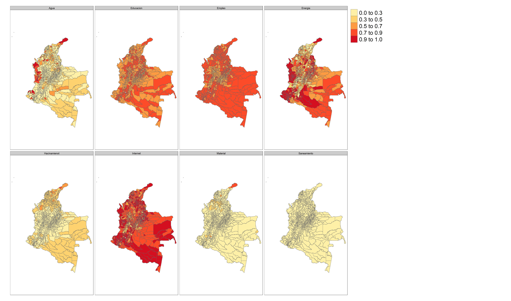

# Mapa del IPM por municipio de Colombia

Dado que los municipios son otro nivel de desagregción, es posible realizar un mapa municipal para $H$, $A$ e $IPM$. Para realizar el proceso, previamente se guardaron las estimaciones necesarias en un archivo _.rds_ el cual usaremos a continuación:
  

```r
library(sf)
library(tmap)
estimado_ipm <- readRDS(file = "Modelo_bayes_HxA/COL/Data/estimado_ipm.rds")
ShapeSAE <- read_sf("Modelo_bayes_HxA/COL/Shape/COL_dam2.shp")

brks_H <- c(0, 0.2 ,0.4, .6, 0.8,  1)
brks_ipm <- c(0,0.01 ,0.04, .07, 0.1,  0.15, 0.25)
brks_A <- c(0,0.04 ,0.05, .06,  0.07,.1)

maps3 <- tm_shape(ShapeSAE %>%
                    left_join(estimado_ipm$dam2,  by = "dam2"))
```

Para crear los mapas se usa la siguiente sintaxis 


```r
Mapa_H <-
  maps3 + tm_polygons(
    "H",
    breaks = brks_H,
    title = "H",
    palette = "YlOrRd",
    colorNA = "white"
  ) 

Mapa_A <-
  maps3 + tm_polygons(
    "A",
    breaks = brks_A,
    title = "A",
    palette = "YlOrRd",
    colorNA = "white"
  ) 
Mapa_ipm <-
  maps3 + tm_polygons(
    "ipm",
    breaks = brks_ipm,
    title = "IPM",
    palette = "YlOrRd",
    colorNA = "white"
  ) 


Mapas <- tmap_arrange(Mapa_H, Mapa_A, Mapa_ipm)

tmap_save(
  Mapas,
  "Modelo_bayes_HxA/COL/Output/COL_IPM.jpeg",
  width = 6920,
  height = 4080,
  asp = 0
)
```


## Mapa municipal por dimensión del IPM


```r
temp_estimate_mpio <- readRDS("Modelo_bayes_HxA/COL/data/temp_estimate_mpio.rds")

brks_dim <- c(0,0.3 ,0.5, .7, 0.9,  1) 
maps2 <- tm_shape(ShapeSAE %>%
                    inner_join(temp_estimate_mpio,  by = "dam2"))

Mapa_ing2 <-
  maps2 + tm_polygons(
    "estimate",
    breaks = brks_dim,
    title = "",
    palette = "YlOrRd",
    colorNA = "white"
  ) +
  tm_facets(by = "Indicador", ncol = 4)

tmap_save(
  Mapa_ing2,
  "Modelo_bayes_HxA/COL/Output/COL_dims_ipm.jpeg",
  width = 6920,
  height = 4080,
  asp = 0
)
```


